```mermaid
graph TD
    %% Main Applications
    Admin[Admin Portal]
    Professionals[Professionals Portal]
    Shared[Shared Components]

    %% Shared Components
    Shared --> Types[Types & Interfaces]
    Shared --> Utils[Utilities]
    Shared --> Components[UI Components]
    Shared --> Contexts[Context Providers]

    %% Types & Interfaces
    Types --> JobTypes[Job Types]
    Types --> DocumentTypes[Document Types]
    Types --> WorkTicketTypes[Work Ticket Types]
    Types --> AssessmentTypes[Assessment Types]

    %% Utilities
    Utils --> PathUtils[Path Management]
    Utils --> Validation[Validation]
    Utils --> Formatting[Formatting]

    %% UI Components
    Components --> CommonUI[Common UI Elements]
    Components --> DocumentUI[Document Components]
    Components --> PropertyUI[Property Components]
    Components --> AssessmentUI[Assessment Components]

    %% Context Providers
    Contexts --> DocumentContext[Document Context]
    Contexts --> JobContext[Job Context]
    Contexts --> SiteDetailsContext[Site Details Context]

    %% Admin Portal Features
    Admin --> WorkTickets[Work Tickets Management]
    Admin --> DocumentReview[Document Review]
    Admin --> JobManagement[Job Management]
    Admin --> AssessmentReview[Assessment Review]

    %% Professionals Portal Features
    Professionals --> ReportWriter[Report Writer]
    Professionals --> DocumentStore[Document Store]
    Professionals --> JobView[Job View]
    Professionals --> AssessmentCreation[Assessment Creation]

    %% Data Flow
    DocumentStore --> DocumentContext
    ReportWriter --> DocumentContext
    WorkTickets --> DocumentContext
    JobView --> JobContext
    AssessmentCreation --> JobContext
    DocumentReview --> DocumentContext

    %% API Routes
    Admin --> AdminAPI[Admin API Routes]
    Professionals --> ProfessionalAPI[Professional API Routes]
    AdminAPI --> DataStore[(Data Store)]
    ProfessionalAPI --> DataStore

    %% Data Store Structure
    DataStore --> Jobs[(Jobs)]
    DataStore --> Documents[(Documents)]
    DataStore --> WorkTickets[(Work Tickets)]
    DataStore --> Assessments[(Assessments)]

    %% Styling
    classDef portal fill:#f9f,stroke:#333,stroke-width:2px
    classDef shared fill:#bbf,stroke:#333,stroke-width:2px
    classDef data fill:#dfd,stroke:#333,stroke-width:2px
    classDef api fill:#ffd,stroke:#333,stroke-width:2px

    class Admin,Professionals portal
    class Shared shared
    class DataStore,Jobs,Documents,WorkTickets,Assessments data
    class AdminAPI,ProfessionalAPI api
```

## System Architecture Overview

### Core Components

1. **Shared Components**
   - Types & Interfaces: Common type definitions used across the system
   - Utilities: Shared utility functions for path management, validation, etc.
   - UI Components: Reusable UI elements
   - Context Providers: State management for documents, jobs, and site details

2. **Admin Portal**
   - Work Tickets Management
   - Document Review
   - Job Management
   - Assessment Review

3. **Professionals Portal**
   - Report Writer
   - Document Store
   - Job View
   - Assessment Creation

### Data Flow

1. **Document Management**
   - Documents are stored in a centralized data store
   - Both portals access documents through the Document Context
   - Document operations are handled through API routes

2. **Job Management**
   - Jobs are managed through the Job Context
   - Both portals can view and update job information
   - Job data is stored in the central data store

3. **Work Tickets**
   - Created by professionals through the Report Writer
   - Managed by admin through the Work Tickets Management
   - Integrated with the document system

4. **Assessments**
   - Created by professionals
   - Reviewed by admin
   - Stored in the central data store

### API Structure

1. **Admin API Routes**
   - Handle admin-specific operations
   - Manage work tickets and document reviews
   - Process assessment approvals

2. **Professional API Routes**
   - Handle professional-specific operations
   - Manage document uploads and job updates
   - Process assessment creation

### Data Storage

1. **Jobs**
   - Store job information
   - Track job status and progress
   - Link to related documents and assessments

2. **Documents**
   - Store document files and metadata
   - Track document versions
   - Link to jobs and work tickets

3. **Work Tickets**
   - Track work ticket status
   - Link to related documents
   - Store work ticket metadata

4. **Assessments**
   - Store assessment data
   - Track assessment status
   - Link to related documents and jobs
