# System Architecture

## Current Architecture (Phase 1)

```mermaid
graph TD
    %% Main Applications
    Admin[Admin Portal<br/>Port 3001]
    Professionals[Professionals Portal<br/>Port 3000]
    Shared[Shared Components<br/>Library]

    %% Shared Components
    Shared --> Types[Types & Interfaces]
    Shared --> Utils[Utilities]
    Shared --> Components[UI Components]
    Shared --> Contexts[Context Providers]
    Shared --> Services[API Services]
    Shared --> Hooks[Custom Hooks]

    %% Types & Interfaces
    Types --> JobTypes[Job Types]
    Types --> DocumentTypes[Document Types]
    Types --> ConsultantTypes[Consultant Types]
    Types --> AssessmentTypes[Assessment Types]

    %% Utilities
    Utils --> PathUtils[Path Management]
    Utils --> Validation[Validation]
    Utils --> Formatting[Formatting]
    Utils --> ReportUtils[Report Utils]

    %% UI Components
    Components --> CommonUI[Common UI Elements]
    Components --> DocumentUI[Document Components]
    Components --> PropertyUI[Property Components]
    Components --> AssessmentUI[Assessment Components]
    Components --> ConsultantUI[Consultant Components]

    %% Context Providers
    Contexts --> DocumentContext[Document Context]
    Contexts --> JobContext[Job Context]
    Contexts --> ConsultantContext[Consultant Context]
    Contexts --> SiteDetailsContext[Site Details Context]

    %% Services
    Services --> JobService[Job Service]
    Services --> DocumentService[Document Service]
    Services --> ConsultantService[Consultant Service]

    %% Hooks
    Hooks --> UseJobs[useJobs Hook]
    Hooks --> UseDocuments[useDocuments Hook]
    Hooks --> UseConsultants[useConsultants Hook]

    %% Admin Portal Features
    Admin --> WorkTickets[Work Tickets Management]
    Admin --> DocumentReview[Document Review]
    Admin --> JobManagement[Job Management]
    Admin --> AssessmentReview[Assessment Review]
    Admin --> ConsultantManagement[Consultant Management]
    Admin --> KnowledgeBase[Knowledge Base Management]
    Admin --> Announcements[Announcement System]

    %% Professionals Portal Features
    Professionals --> Dashboard[Dashboard]
    Professionals --> JobManagement[Job Management]
    Professionals --> DocumentStore[Document Store]
    Professionals --> ConsultantStore[Consultant Store]
    Professionals --> Consultants[Consultant Integration]
    Professionals --> KnowledgeBase[Knowledge Base]
    Professionals --> Assessments[Assessment Tools]

    %% Data Flow
    DocumentStore --> DocumentContext
    ConsultantStore --> ConsultantContext
    WorkTickets --> DocumentContext
    JobManagement --> JobContext
    AssessmentReview --> DocumentContext

    %% API Routes
    Admin --> AdminAPI[Admin API Routes]
    Professionals --> ProfessionalAPI[Professional API Routes]
    AdminAPI --> CurrentDataStore[(Current Data Store<br/>File System + localStorage)]
    ProfessionalAPI --> CurrentDataStore

    %% Current Data Store Structure
    CurrentDataStore --> Jobs[(Jobs<br/>JSON Files)]
    CurrentDataStore --> Documents[(Documents<br/>File System)]
    CurrentDataStore --> WorkTickets[(Work Tickets<br/>JSON Files)]
    CurrentDataStore --> Assessments[(Assessments<br/>JSON Files)]
    CurrentDataStore --> Consultants[(Consultants<br/>JSON Files)]
    CurrentDataStore --> UserPrefs[(User Preferences<br/>localStorage)]

    %% State Management
    Admin --> ReactQuery[React Query<br/>Server State]
    Professionals --> ReactQuery
    Admin --> Zustand[Zustand<br/>Client State]
    Professionals --> Zustand

    %% Styling
    classDef portal fill:#f9f,stroke:#333,stroke-width:2px
    classDef shared fill:#bbf,stroke:#333,stroke-width:2px
    classDef data fill:#dfd,stroke:#333,stroke-width:2px
    classDef api fill:#ffd,stroke:#333,stroke-width:2px
    classDef state fill:#fdf,stroke:#333,stroke-width:2px

    class Admin,Professionals portal
    class Shared shared
    class CurrentDataStore,Jobs,Documents,WorkTickets,Assessments,Consultants,UserPrefs data
    class AdminAPI,ProfessionalAPI api
    class ReactQuery,Zustand state
```

## Target Architecture (Phase 1.5+)

```mermaid
graph TD
    %% Main Applications
    Admin[Admin Portal<br/>Port 3001]
    Professionals[Professionals Portal<br/>Port 3000]
    Shared[Shared Components<br/>Library]

    %% Shared Components
    Shared --> Types[Types & Interfaces]
    Shared --> Utils[Utilities]
    Shared --> Components[UI Components]
    Shared --> Contexts[Context Providers]
    Shared --> Services[API Services]
    Shared --> Hooks[Custom Hooks]
    Shared --> Stores[Zustand Stores]

    %% Types & Interfaces
    Types --> JobTypes[Job Types]
    Types --> DocumentTypes[Document Types]
    Types --> ConsultantTypes[Consultant Types]
    Types --> AssessmentTypes[Assessment Types]
    Types --> UserTypes[User Types]

    %% Utilities
    Utils --> PathUtils[Path Management]
    Utils --> Validation[Validation]
    Utils --> Formatting[Formatting]
    Utils --> ReportUtils[Report Utils]
    Utils --> AuthUtils[Auth Utils]

    %% UI Components
    Components --> CommonUI[Common UI Elements]
    Components --> DocumentUI[Document Components]
    Components --> PropertyUI[Property Components]
    Components --> AssessmentUI[Assessment Components]
    Components --> ConsultantUI[Consultant Components]
    Components --> AuthUI[Auth Components]

    %% Context Providers
    Contexts --> AuthContext[Auth Context]
    Contexts --> DocumentContext[Document Context]
    Contexts --> JobContext[Job Context]
    Contexts --> ConsultantContext[Consultant Context]
    Contexts --> SiteDetailsContext[Site Details Context]

    %% Services
    Services --> AuthService[Auth Service]
    Services --> JobService[Job Service]
    Services --> DocumentService[Document Service]
    Services --> ConsultantService[Consultant Service]
    Services --> AIService[AI Service]

    %% Hooks
    Hooks --> UseAuth[useAuth Hook]
    Hooks --> UseJobs[useJobs Hook]
    Hooks --> UseDocuments[useDocuments Hook]
    Hooks --> UseConsultants[useConsultants Hook]

    %% Stores
    Stores --> AuthStore[Auth Store]
    Stores --> AppStore[App Store]
    Stores --> FormStore[Form Store]

    %% Admin Portal Features
    Admin --> WorkTickets[Work Tickets Management]
    Admin --> DocumentReview[Document Review]
    Admin --> JobManagement[Job Management]
    Admin --> AssessmentReview[Assessment Review]
    Admin --> ConsultantManagement[Consultant Management]
    Admin --> KnowledgeBase[Knowledge Base Management]
    Admin --> Announcements[Announcement System]
    Admin --> UserManagement[User Management]

    %% Professionals Portal Features
    Professionals --> Dashboard[Dashboard]
    Professionals --> JobManagement[Job Management]
    Professionals --> DocumentStore[Document Store]
    Professionals --> ConsultantStore[Consultant Store]
    Professionals --> Consultants[Consultant Integration]
    Professionals --> KnowledgeBase[Knowledge Base]
    Professionals --> Assessments[Assessment Tools]
    Professionals --> AIAssistant[AI Assistant]

    %% Data Flow
    DocumentStore --> DocumentContext
    ConsultantStore --> ConsultantContext
    WorkTickets --> DocumentContext
    JobManagement --> JobContext
    AssessmentReview --> DocumentContext
    AIAssistant --> AIService

    %% API Routes
    Admin --> AdminAPI[Admin API Routes]
    Professionals --> ProfessionalAPI[Professional API Routes]
    AdminAPI --> Supabase[Supabase Platform]
    ProfessionalAPI --> Supabase

    %% Supabase Platform
    Supabase --> PostgreSQL[(PostgreSQL<br/>Database)]
    Supabase --> Auth[Supabase Auth]
    Supabase --> Storage[Supabase Storage]
    Supabase --> Realtime[Supabase Realtime]
    Supabase --> EdgeFunctions[Edge Functions]

    %% Database Schema
    PostgreSQL --> JobsTable[(Jobs Table)]
    PostgreSQL --> DocumentsTable[(Documents Table)]
    PostgreSQL --> WorkTicketsTable[(Work Tickets Table)]
    PostgreSQL --> AssessmentsTable[(Assessments Table)]
    PostgreSQL --> ConsultantsTable[(Consultants Table)]
    PostgreSQL --> UsersTable[(Users Table)]
    PostgreSQL --> UserPrefsTable[(User Preferences Table)]

    %% State Management
    Admin --> ReactQuery[React Query<br/>Server State]
    Professionals --> ReactQuery
    Admin --> Zustand[Zustand<br/>Client State]
    Professionals --> Zustand

    %% AI Integration
    AIService --> AIProvider[AI Provider<br/>OpenAI/Claude]
    AIAssistant --> AIService

    %% Styling
    classDef portal fill:#f9f,stroke:#333,stroke-width:2px
    classDef shared fill:#bbf,stroke:#333,stroke-width:2px
    classDef data fill:#dfd,stroke:#333,stroke-width:2px
    classDef api fill:#ffd,stroke:#333,stroke-width:2px
    classDef state fill:#fdf,stroke:#333,stroke-width:2px
    classDef supabase fill:#ffb,stroke:#333,stroke-width:2px
    classDef ai fill:#bfb,stroke:#333,stroke-width:2px

    class Admin,Professionals portal
    class Shared shared
    class PostgreSQL,JobsTable,DocumentsTable,WorkTicketsTable,AssessmentsTable,ConsultantsTable,UsersTable,UserPrefsTable data
    class AdminAPI,ProfessionalAPI api
    class ReactQuery,Zustand state
    class Supabase,Auth,Storage,Realtime,EdgeFunctions supabase
    class AIService,AIProvider,AIAssistant ai
```

## System Architecture Overview

### Core Components

#### **1. Dual Portal System**
- **Admin Portal (Port 3001)**: Administrative interface for managing consultants, reviewing work tickets, and overseeing platform operations
- **Professional Portal (Port 3000)**: User-facing interface for urban planning professionals to manage projects and collaborate with consultants
- **Shared Components Library**: Reusable components, types, utilities, and services used across both portals

#### **2. Shared Components Architecture**
- **Types & Interfaces**: Common TypeScript type definitions for jobs, documents, consultants, and assessments
- **UI Components**: Reusable UI elements built with shadcn/ui and Radix UI
- **Context Providers**: React contexts for state management (Document, Job, Consultant, Site Details)
- **API Services**: Centralized service layer for API communication
- **Custom Hooks**: Reusable React hooks for common functionality
- **Utilities**: Helper functions for validation, formatting, path management, and report generation

#### **3. State Management Strategy**
- **Server State**: React Query for API data, caching, and synchronization
- **Client State**: Zustand for UI state, user preferences, and form management
- **Context State**: React Context for shared state across components
- **Local State**: useState/useReducer for component-specific state

### Data Flow Architecture

#### **Current Data Flow (Phase 1)**
1. **Document Management**
   - Documents stored in file system with metadata in JSON files
   - Both portals access documents through Document Context
   - Document operations handled through API routes

2. **Job Management**
   - Jobs managed through Job Context with localStorage persistence
   - Both portals can view and update job information
   - Job data stored in JSON files with file system backup

3. **Consultant Integration**
   - Consultant data stored in JSON files
   - Quote requests tracked in localStorage
   - Real-time status updates through polling

4. **Work Tickets**
   - Created by professionals through consultant integration
   - Managed by admin through work ticket management
   - Integrated with document system for file handling

#### **Target Data Flow (Phase 1.5+)**
1. **Database-Driven Architecture**
   - PostgreSQL database with Supabase for data persistence
   - Row-level security (RLS) for data access control
   - Real-time subscriptions for live updates

2. **Authentication & Authorization**
   - Supabase Auth for user authentication
   - Role-based access control (RBAC)
   - JWT tokens for session management

3. **File Storage**
   - Supabase Storage for document and file management
   - Automatic file versioning and metadata tracking
   - Secure file access with signed URLs

### API Architecture

#### **Current API Structure**
1. **Admin API Routes**
   - `/api/admin/*` - Admin-specific operations
   - `/api/work-tickets/*` - Work ticket management
   - `/api/consultants/*` - Consultant management
   - `/api/assessments/*` - Assessment review
   - `/api/documents/*` - Document handling

2. **Professional API Routes**
   - `/api/jobs/*` - Job management
   - `/api/documents/*` - Document operations
   - `/api/consultant-tickets/*` - Consultant ticket processing
   - `/api/assessments/*` - Assessment creation

#### **Target API Structure (Phase 1.5+)**
1. **Supabase Integration**
   - Direct database queries through Supabase client
   - Real-time subscriptions for live updates
   - Edge functions for complex business logic
   - Row-level security for data protection

2. **AI Service Integration**
   - `/api/ai/*` - AI assistant endpoints
   - Document analysis and processing
   - Compliance checking and recommendations
   - Natural language query processing

### Data Storage Architecture

#### **Current Storage (Phase 1)**
1. **Jobs**
   - JSON files with job information
   - File system storage for job documents
   - localStorage for user preferences

2. **Documents**
   - File system storage with metadata
   - Version control through file naming
   - JSON files for document metadata

3. **Work Tickets**
   - JSON files for ticket data
   - File system for ticket documents
   - Status tracking through file updates

4. **Assessments**
   - JSON files for assessment data
   - File system for assessment documents
   - Template-based assessment generation

#### **Target Storage (Phase 1.5+)**
1. **PostgreSQL Database**
   - Normalized database schema
   - Foreign key relationships
   - Indexed queries for performance
   - Transaction support for data integrity

2. **Supabase Storage**
   - Organized bucket structure
   - Automatic file versioning
   - Secure access control
   - CDN integration for performance

3. **Real-time Features**
   - Live updates through WebSocket connections
   - Optimistic updates for better UX
   - Conflict resolution for concurrent edits

### Security Architecture

#### **Current Security (Phase 1)**
- Basic session management
- File system access control
- Input validation and sanitization

#### **Target Security (Phase 1.5+)**
1. **Authentication**
   - Supabase Auth with multiple providers
   - Multi-factor authentication (MFA)
   - Session management with JWT tokens

2. **Authorization**
   - Role-based access control (RBAC)
   - Row-level security (RLS) policies
   - API endpoint protection

3. **Data Protection**
   - Encrypted data transmission (HTTPS)
   - Encrypted data at rest
   - Audit logging for compliance

### Performance Architecture

#### **Current Performance (Phase 1)**
- React Query for API caching
- Component-level optimization
- File system-based storage

#### **Target Performance (Phase 1.5+)**
1. **Database Optimization**
   - Indexed queries for fast retrieval
   - Connection pooling for scalability
   - Query optimization and monitoring

2. **Frontend Optimization**
   - Code splitting and lazy loading
   - Bundle optimization and compression
   - CDN integration for static assets

3. **Caching Strategy**
   - React Query for server state caching
   - Zustand for client state persistence
   - CDN caching for static content

### Scalability Architecture

#### **Current Scalability (Phase 1)**
- Single-server deployment
- File system limitations
- Basic load handling

#### **Target Scalability (Phase 1.5+)**
1. **Database Scalability**
   - Supabase managed PostgreSQL
   - Automatic scaling and backups
   - Read replicas for performance

2. **Application Scalability**
   - Containerized deployment
   - Load balancing support
   - Horizontal scaling capabilities

3. **Storage Scalability**
   - Supabase Storage with CDN
   - Automatic file optimization
   - Unlimited storage capacity

### Integration Architecture

#### **Current Integrations (Phase 1)**
- File system integration
- Basic HTTP API communication
- localStorage for client-side data

#### **Target Integrations (Phase 1.5+)**
1. **AI Service Integration**
   - OpenAI/Claude API integration
   - Document analysis services
   - Natural language processing

2. **External Service Integration**
   - GIS services for spatial data
   - Payment gateway integration
   - Email service integration

3. **Third-party Integrations**
   - Council system connections
   - BIM software integration
   - Document verification services

## Migration Strategy

### **Phase 1.5: Infrastructure Modernization**
1. **Database Migration**
   - Set up Supabase project
   - Create database schema
   - Migrate existing data
   - Update API endpoints

2. **Authentication Implementation**
   - Implement Supabase Auth
   - Add user management
   - Update authorization logic
   - Test security policies

3. **State Management Optimization**
   - Implement Zustand stores
   - Optimize React Query usage
   - Add real-time subscriptions
   - Update component architecture

### **Phase 2: AI Integration**
1. **AI Service Setup**
   - Integrate AI provider APIs
   - Implement document analysis
   - Add compliance checking
   - Create AI assistant interface

2. **Advanced Features**
   - Real-time AI assistance
   - Predictive analytics
   - Automated reporting
   - Intelligent workflows

This updated system architecture provides a comprehensive view of both the current implementation and the target architecture, with clear migration paths and integration strategies.